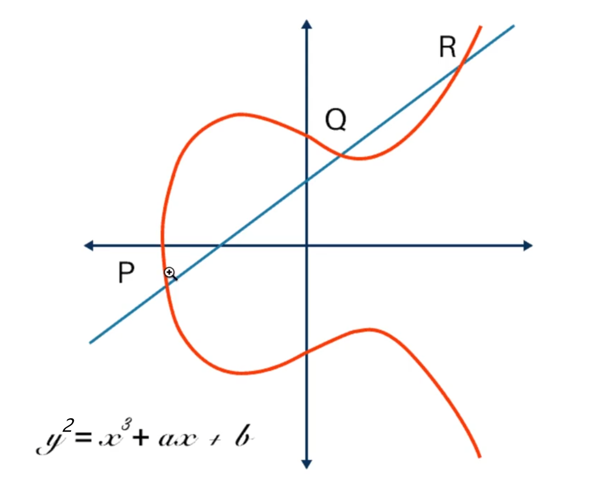
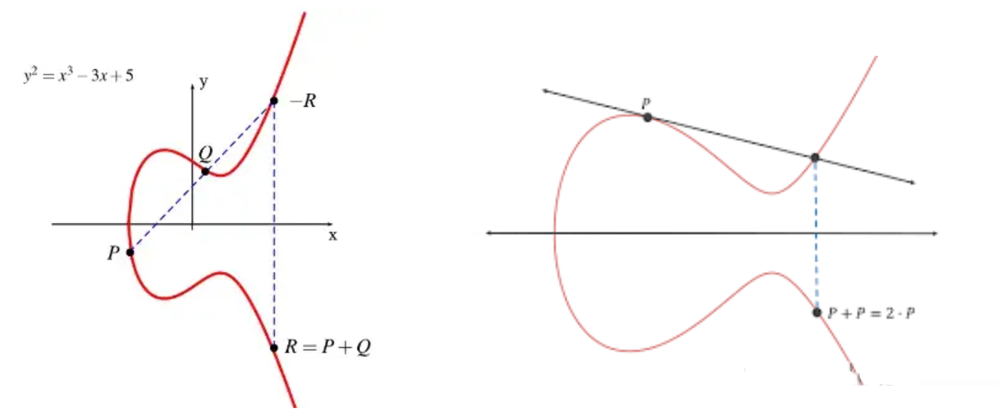
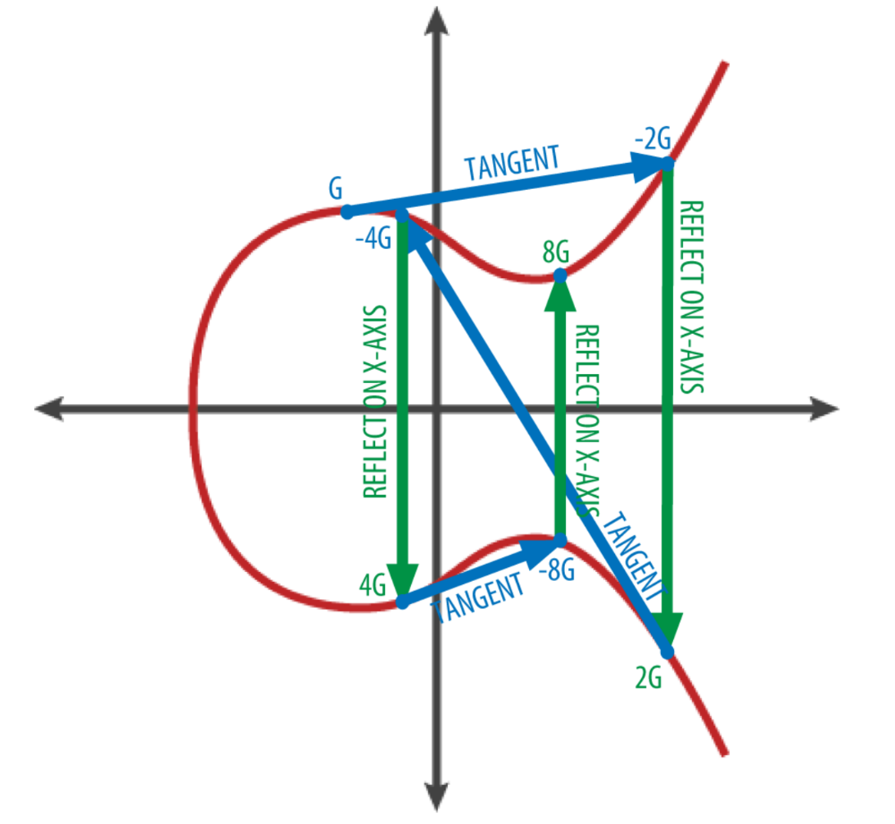

# blockchain

- Reference

  [区块链的系统探索之路：椭圆曲线之有限域](https://blog.csdn.net/tyler_download/article/details/128744082?csdn_share_tail=%7B%22type%22%3A%22blog%22%2C%22rType%22%3A%22article%22%2C%22rId%22%3A%22128744082%22%2C%22source%22), 


- CS core

  操作系统、计算机网络、编译器、数据库 (数据结构与算法)

  区块链、大模型(ChatGPT-mini)
  
- 思路

  琢磨底层原理

  逐步代码实现


## 基本概念

### 椭圆曲线

- 区块链构建的基础

  椭圆曲线 (关于x轴对称)

  研究问题：过椭圆曲线一点Q，延申到椭圆曲线上的另外一点P，连接PQ；PQ会与椭圆直线有**第三个交点**R
  $$
  y^2=x^3+ax+b
  $$
  

- 展示

  多项式的计算要基于除法求余的基础

  需要专门指定公式中a, b, p 这个几个参数。因此它也有一个专有名字叫secp256k1

  椭圆曲线在运用时，我们需要处理数值相当大的点

  ```python
  def is_on_blockchain_curve(point):
      '''
      p = 2 ^ 256 - 2 ^32 - 2 ^ 9 - 2 ^ 8 - 2 ^ 7 - 2 ^ 6 - 2 ^ 4 - 1
      a = 0
      b = 7
      y ^ 2 mod p = x^3 + a*x + b mod p
      该函数判断给定的点是否在椭圆曲线上, 其中point包含两个数值(x,y)
      '''
      p = 2 ** 256 - 2 ** 32 - 2 ** 9 - 2 ** 8 - 2 ** 7 - 2 ** 6 - 2 ** 4 - 1
      return (point[1] ** 2) % p == (point[0] ** 3 + 7) % p
  
  
  p = (55066263022277343669578718895168534326250603453777594175500187360389116729240,
       32670510020758816978083085130507043184471273380659243275938904335757337482424)
  print(f"is point p on curve: {is_on_blockchain_curve(p)}")
  
  
  ```

- 椭圆曲线的加法操作 (区别于四则运算)

  P, Q是曲线上两点，P + Q的结果就是：先将P,Q两点连线，这条线会跟曲线交在第三点也就是上方的R点，然后找这点相对x轴的对称点，那点的左边就是P+Q的结果

  如果P, Q指的是同一点，那么就在这点上做曲线的切线，这条切线会跟曲线交于第二点，把交点根据x轴进行对称操作，所得的点就是加法的结果

  

  


### 有限域 及其运算

- 概念：有限域 (代数学基本概念)

  有限：集合中元素的个数是有限的

  域：一种具备给定性质的集合 (抽象代数)
  
- Example
  $$
  Example: (0,1,2,3,4), mod(order) ✔
  \\
  Example: (-1,0,1) ✔
  $$

- Code

  有限域的加法、乘法、幂运算

  基于费马小定理的除法 (乘法的逆操作)

  ```python
  class LimitFieldElement:
      """
      有限域
      order: 域的阶 必须是素数
      num: 具体数字
      """
      def __init__(self, num, order):
          if not (0 <= num <= order - 1): 
              err = f"元素 {num} 数值必须在 0 到 {order-1} 之间"
              raise ValueError(err)
          self.num = num
          self.order = order
  
      def __repr__(self):
          return f"LimitFieldElement_{self.order}({self.num})"
      
      def __eq__(self, other):
          """ 判断两个有限域元素是否相等 (order num) """
          if other is None:
              return False
          return self.num == other.num and self.order == other.order
      
      def __ne__(self, other):
          """ 判断两个有限域元素是否不相等 (order num) """
          if other is None:
              return True
          return self.num!= other.num or self.order!= other.order
      
      def __add__(self, other):
          """ 有限域加法(普通加法 再求余) """
          if other is None:
              raise ValueError("other element is None")
          if self.order != other.order:
              raise ValueError("two elements are not in the same field")
          
          num = (self.num + other.num) % self.order
          return self.__class__(num, self.order)
          # return LimitFieldElement(num, self.order)
  
      def __mul__(self, other):
          """ 有限域乘法(普通乘法 再求余) """
          if other is None:
              raise ValueError("other element is None")
          if self.order != other.order:
              raise ValueError("two elements are not in the same field")
          
          num = (self.num * other.num) % self.order
          return self.__class__(num, self.order)
      
      def __pow__(self, power, modulo=None):
          """ 有限域幂运算(普通幂运算 再求余) """
          while power < 0:
              power += self.order  
          
          num = pow(self.num, power, self.order)
          return self.__class__(num, self.order)
      
      def __truediv__(self, other):
          """ 有限域除法(乘法的逆运算 基于费马小定理) """
          if other is None:
              raise ValueError("other element is None")
          if self.order != other.order:
              raise ValueError("two elements are not in the same field")
          
          negative = other ** (self.order - 2)
          num = (self.num * negative.num) % self.order
          return self.__class__(num, self.order)
  
  
  # Example: (0,1,2,3,4)
  a = LimitFieldElement(0, 5)
  b = LimitFieldElement(1, 5)
  c = LimitFieldElement(2, 5)
  d = LimitFieldElement(3, 5)
  e = LimitFieldElement(4, 5)
  
  # 加法
  # print(a + b)  # LimitFieldElement_5(1)
  # print(a + c)  # LimitFieldElement_5(2)
  # print(d + d)  # LimitFieldElement_5(1)
  # print(d + e)  # LimitFieldElement_5(2)
  
  # 乘法
  # print(a * b)  # LimitFieldElement_5(0)
  # print(a * c)  # LimitFieldElement_5(0)
  # print(d * d)  # LimitFieldElement_5(4)
  # print(d * e)  # LimitFieldElement_5(2)
  
  # 幂运算
  # print(a ** 4)  # LimitFieldElement_5(0)
  # print(c ** -4)  # LimitFieldElement_5(2)???
  # print(c ** 3)  # LimitFieldElement_5(3)
  # print(c ** 4)  # LimitFieldElement_5(1)
  
  # 除法 (乘法的逆运算 基于费马小定理)
  # print(c / b)  # LimitFieldElement_5(2)
  # print(c / c)  # LimitFieldElement_5(1)
  # print(d / d)  # LimitFieldElement_5(1)
  # print(d / e)  # LimitFieldElement_5(2)
  
  ```

  


### 椭圆曲线运算

- "加法"操作 (分类讨论)

  直线与x轴垂直：认为是第三个交点在无限远处 两个点互为相反数

  AB两点重合

  一般情况

- Code

  椭圆曲线的基本框架

  四种情况分类讨论

  ```
  
  ```

  


